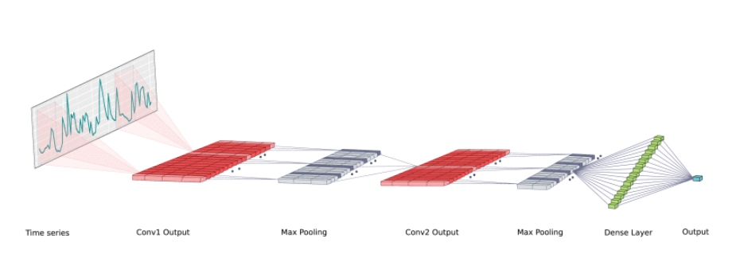

## DeepAnt Implementation

This is an Implementation of the [DeepAnt Architecture for Anomaly Detection in Univariate TimeSeries](DeepAnT_Paper.pdf) using `Pytorch Lightning`. 

The Folder Structure goes as follows:

* **checkpoints**: Checkpoint of the best model. It can be loaded to check inference.
* **data**: Data used in the training Process.
* `DeepAnt.ipynb`: The Notebook showing the training process plus evaluation. All the code is modularized into `utils.py` and `deepant.py`.

In this case the Algorithm was applied to one of the Numenta Benchmarks mentioned in the paper. In order to reproduce the algorithm the same Hyperparameters were used when available:

* SEQ_LEN: 10
* 2 1D-Convolutional Blocks:
  * Number of Filters: 32
  * Conv Kernel 3x3
  * Relu Activation Function
  * MaxPool Kernel: 2x2
* 1 Fully Connected Block
  * Fully Connected Hidden Layer: 40
  * ReLU Activation Function
  * Fully Connected Dropout Rate: 0.25
  * p_w: 1

* Training Epochs: 30
* Adam Optimizer: 
  * Learning Rate: 1e-5
  * MAE Loss
* Error Calculation: L2 Norm
  
  